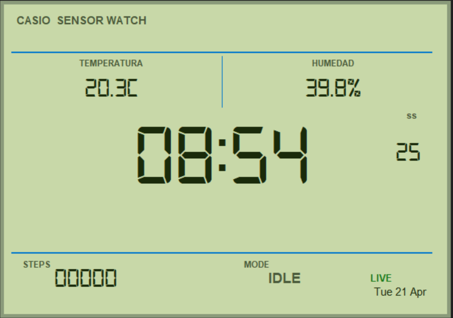
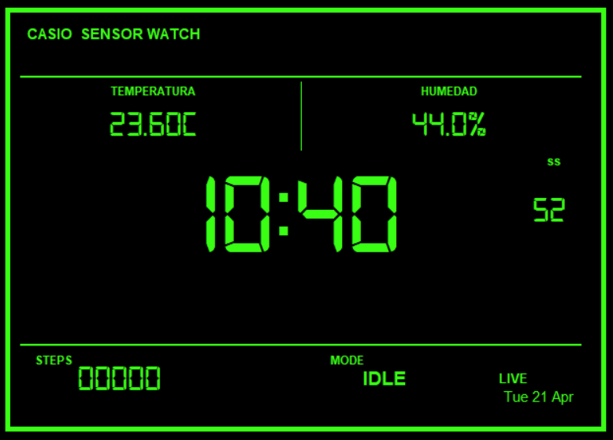
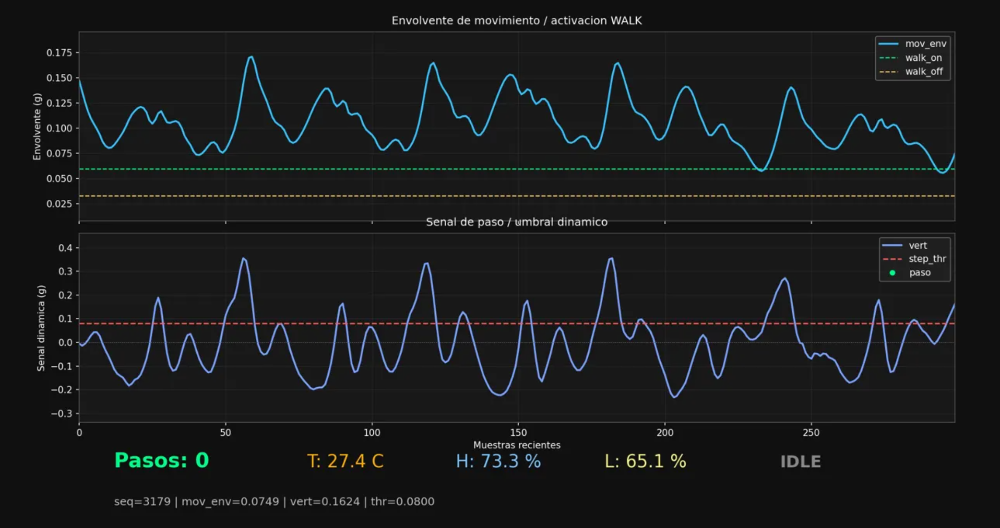
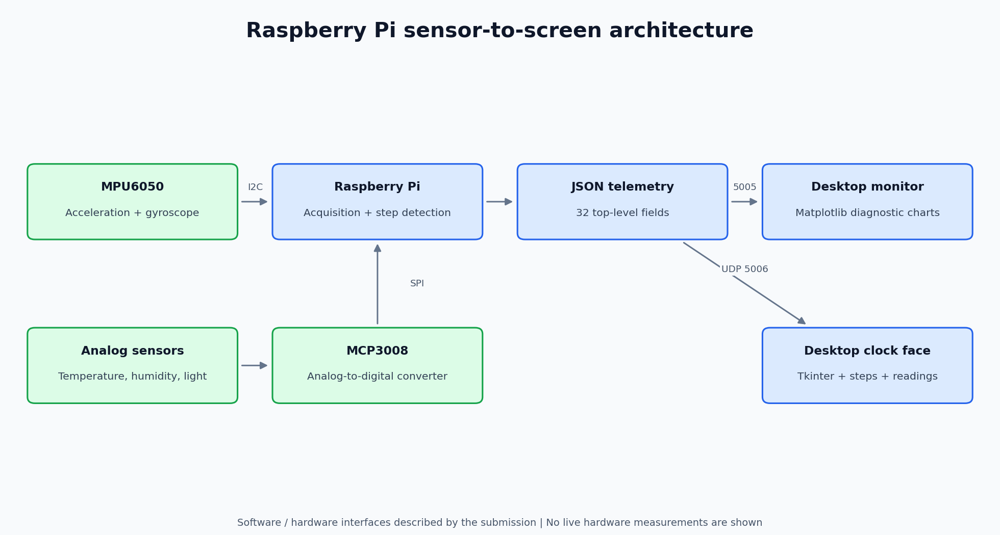
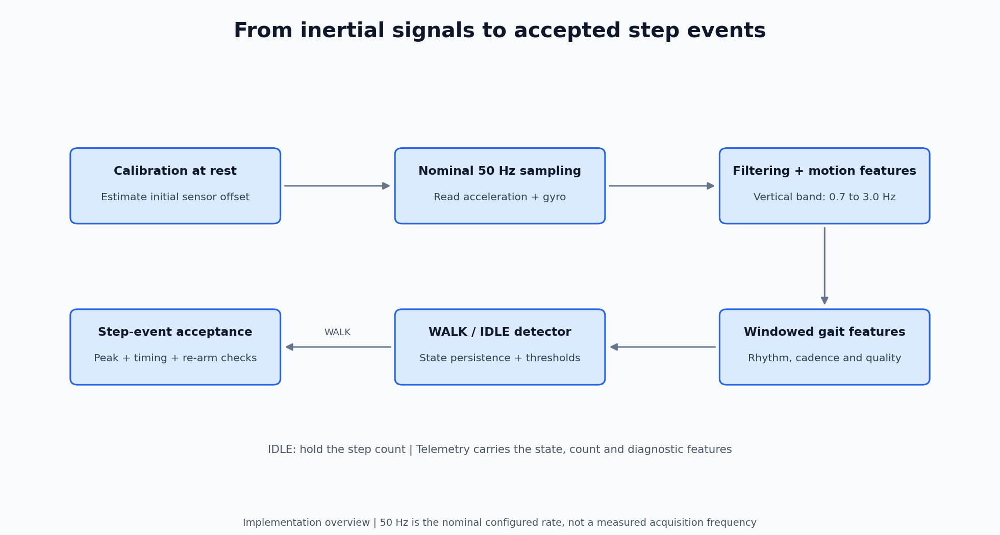

# Raspberry Pi Smartwatch and Pedometer Prototype


**A sensor-to-screen prototype: acquire motion and environmental signals, detect walking, count steps and stream telemetry to a desktop clock interface.**

Academic project by **Miguel Pajuelo Gómez and Jorge Ois de Pascual** for *Sistemas Electrónicos*, ICAI, Universidad Pontificia Comillas. The repository contains the Raspberry Pi acquisition software and both desktop receivers from the selected submission.

[Usage examples](#the-prototype-in-use) · [Architecture](#architecture) · [Signal processing](#from-motion-to-steps) · [Hardware](#hardware-and-telemetry) · [Run it](#run-the-prototype) · [Presentation](documentacion/presentacion.pptx)

## The prototype in use

The practical goal is to combine motion and environmental sensing with a screen a user can read: a clock face for everyday information and a technical monitor for inspecting the detector.

### Clock face: daylight mode



The interface presents the time/date, step count, temperature, humidity and activity/connection states together. This original capture shows **IDLE** and **LIVE**; it does not demonstrate a measured step-count accuracy.

<details>
<summary><strong>Clock face: night mode</strong></summary>



The alternate palette makes the clock's night mode visible. The application's mode-switch threshold is described below.

</details>

### Technical monitor: inspect the detector



The upper plot shows the movement envelope and WALK activation/deactivation thresholds. The lower plot shows the dynamic step signal and step threshold; the bottom strip presents the counter, environmental readings and detector state. The horizontal axis is **recent samples**, not elapsed seconds.

All three images were extracted **unchanged** from the [original presentation](documentacion/presentacion.pptx): slide 9 for the clock screens and slide 7 for the technical monitor. They are historical interface evidence, not new hardware tests; their readings and thresholds can differ from the packaged version's calibration.

| User action | What the prototype does | What the user sees |
|---|---|---|
| Start the receivers and then the Pi sender. | Calibrates at rest and streams the common telemetry packet. | Connection state and incoming readings on the desktop. |
| Move with the sensor assembly. | Evaluates motion, gait state and accepted step events. | State and session step count, subject to the documented display gain. |
| Inspect the technical window. | Plots motion features and thresholds alongside environmental values. | Signals that help explain the detector's current decision. |

## What the project demonstrates

- **Hardware interfaces:** reading an MPU6050 over I2C and analog sensors through an MCP3008 ADC over SPI.
- **Signal processing:** initial calibration, filtering, gait features and a WALK/IDLE detector before accepting step events.
- **Networking:** serialising a common JSON packet and transmitting it to two UDP receivers.
- **Desktop visualisation:** a Matplotlib technical monitor and a Tkinter clock face with environmental readings.

## Architecture



The desktop displays data acquired by the Pi; it is not the sensor acquisition device. The two interfaces receive the same packet on separate ports.

## From motion to steps



This diagram summarises the implementation in [`enviar_informacion.py`](raspberry_pi/enviar_informacion.py), rather than a measured sensor trace. The gait filter uses a 0.7–3.0 Hz band and a 2.8-second analysis window. Sampling is configured at 50 Hz; effective acquisition frequency and step-count accuracy have not been measured in the repository preparation.

## Hardware and telemetry

| Component | Software configuration |
|---|---|
| MPU6050 | I2C bus 1, address `0x68`; acceleration, angular velocity and sensor temperature. |
| MCP3008 | SPI analog-to-digital conversion, 3.3 V reference. |
| Analog channels | CH0 humidity, CH1 temperature, CH2 light. |
| Network | Pi sends to `PC_IP`; receivers bind UDP ports 5005 and 5006. |

Enable **I2C and SPI** in Raspberry Pi OS and check the physical assembly described in the [original presentation](documentacion/presentacion.pptx). The repository does not contain a separate wiring schematic absent from that submission.

The common packet has **32 top-level fields**, including timestamp/sequence, raw IMU axes, filtered motion features, `steps`, `walk_mode`, cadence and environmental values. A nested `raw` object contains analog voltages. The real packet builder and receiver parsers were checked together with synthetic telemetry; no live sensor measurements are presented as test results.

## Repository guide

| File | Purpose |
|---|---|
| [raspberry_pi/enviar_informacion.py](raspberry_pi/enviar_informacion.py) | IMU/analog acquisition, calibration, step detection and UDP transmission. |
| [raspberry_pi/leer_sensores_terminal.py](raspberry_pi/leer_sensores_terminal.py) | Inspect analog sensor readings in the terminal. |
| [ordenador/recibir_informacion.py](ordenador/recibir_informacion.py) | Receive telemetry and display diagnostic charts. |
| [ordenador/caratula_reloj.py](ordenador/caratula_reloj.py) | Clock face, displayed steps and environmental indicators. |
| [documentacion/presentacion.pptx](documentacion/presentacion.pptx) | Original hardware/software presentation. |

## Run the prototype

Use a separate Python environment on each device and keep the Pi still during initial calibration. Both devices must be able to exchange UDP traffic on the configured ports.

### 1. Start the desktop receivers

PowerShell, from the repository root:

```powershell
python -m venv .venv
.\.venv\Scripts\python.exe -m pip install -r ordenador/requirements.txt
.\.venv\Scripts\python.exe ordenador/recibir_informacion.py
```

In a second terminal, from the same directory:

```powershell
.\.venv\Scripts\python.exe ordenador/caratula_reloj.py
```

Tkinter must be available in the desktop Python installation. On Linux, the system package may be `python3-tk`; use `.venv/bin/python` for the receiver commands.

### 2. Start acquisition on the Raspberry Pi

From the repository root on the Pi:

```sh
python3 -m venv .venv
.venv/bin/python -m pip install -r raspberry_pi/requirements.txt
export PC_IP=IP_OF_THE_DESKTOP
.venv/bin/python raspberry_pi/enviar_informacion.py
```

`PC_IP` defaults to `127.0.0.1`, so set the desktop's actual IP when using two devices. [.env.example](.env.example) documents this variable; it is not read automatically.

For analog-only inspection on the Pi:

```sh
.venv/bin/python raspberry_pi/leer_sensores_terminal.py
```

## Interpretation and validation

| Behaviour | What to expect |
|---|---|
| Displayed steps | Receivers show session-relative steps and apply `STEP_DISPLAY_GAIN = 1.3`; this differs from the raw sender counter. |
| Environmental conversion | Includes the empirical temperature/humidity adjustments used in the submission. |
| Clock night mode | Effective light threshold is 15%; an introductory code comment mentions 40%. |
| Clock typography | Requests `Digital-7` when installed; otherwise the system may substitute a font. The font file is not redistributed. |

All four Python scripts were parsed successfully, and packet construction/parsing was checked without opening GUI windows, UDP sockets, I2C or SPI. These checks do not establish physical accuracy or a successful two-device run. See [VALIDACION.md](VALIDACION.md) for details.

The working archive contains other calibrations. This repository retains one coherent submission version instead of mixing sender/receiver versions; [PROCEDENCIA.md](PROCEDENCIA.md) records that selection.
